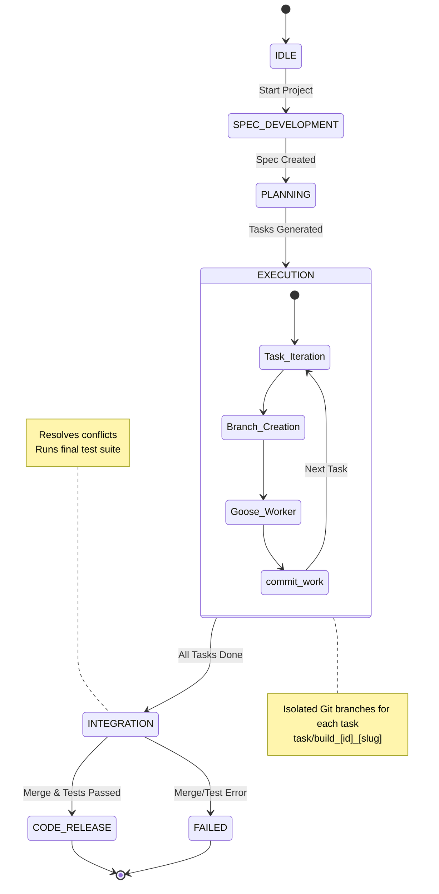

# Software Factory Architecture

## 🏗 Workflow Components

### 1. Orchestrator (`factory.py`)
The central state machine that manages transitions and maintains the build context (token usage, project history, etc.).

### 2. Planner Agent
Decomposes high-level requirements into a discrete `tasks.json` file.

### 3. Worker Fleet
Stateless Goose sessions instantiated per task. Each worker is given a fresh git branch to prevent cross-contamination.

### 4. Integration Agent
A specialized session that performs the complex multi-branch merge, resolves file-level conflicts, and executes a final quality gate.

### 5. Web Dashboard (`dashboard.py` + `static/`)
A real-time observability interface with a log-focused view, resource monitoring, and a task-orchestration strip.
