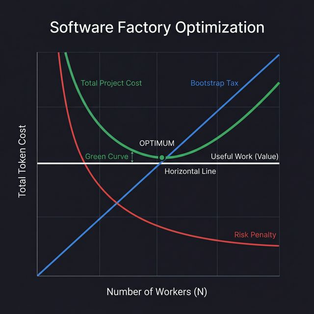

# The Optimized Granularity Model (OGM)

## 📊 Decoding the Optimization Space

Each line in the graph above represents a specific force or benchmark in your factory's economics:

### **🏁 Useful Work / Value (Horizontal White Line)**
- **Behavior**: Perfectly Horizontal.
- **Logic**: For a defined objective (e.g., "Build a React App"), the total volume of "useful" code is a constant. Whether you use 1 worker or 20, the final product's baseline value remains the same. This is your **North Star**.

### **📈 Bootstrap Tax (Blue Line)**
- **Behavior**: Linear ($N \times B$).
- **Logic**: The cost of "Goose-OS Entry." Every time you add a worker, you pay for the system prompt and context loading.

### **📉 Risk Penalty (Red Curve)**
- **Behavior**: Exponential Decay.
- **Logic**: The cost of failure. Larger tasks ($N$ is small) have a high probability of error. Splitting tasks makes them safer and reduces the "Retry Tax."

### **🏗️ Overhead (Orange Line)**
- **Behavior**: Constant ($S + P + I$).
- **Logic**: The fixed cost of the Orchestrator (Spec, Planning, and Merging).

### **✅ Total Project Cost (Green Curve)**
- **Behavior**: U-Shaped (The Parabola of Profit).
- **Logic**: The sum of all infrastructure costs sitting *on top* of your Useful Work.
- **The Gap**: The vertical distance between the **Green Curve** and the **White Line** is your **Infrastructure Tax**. The smaller this gap, the higher your ROI.

## 🎯 Where does FTE fit?

**Functional Token Efficiency (FTE)** is not a point on the graph; it is the **Efficiency Score** of any given point on the X-axis (N).

- **Maximum FTE**: This occurs strictly at the **Sweet Spot**. This is the point where the ratio of "Useful Work" to "Total Tokens" is at its peak.
- **Left of the Spot**: FTE drops because the **Risk Penalty (Red)** is too high. You are wasting tokens on failures and retries.
- **Right of the Spot**: FTE drops because the **Bootstrap Tax (Blue)** is too high. You are wasting tokens starting too many agents.

> [!TIP]
> **The Goal**: Your factory should aim to operate at the **local minimum of the Green Curve**, which automatically results in your **Maximum FTE**.

## 🧩 The Variables

| Symbol | Concept | Value Range | Impact |
| :--- | :--- | :--- | :--- |
| **B** | **Bootstrap Tax** | ~3,100 | Fixed cost per worker. Favors **low N**. |
| **W** | **Work Unit** | 1k - 15k | Useful output tokens. Favors **high N**. |
| **P** | **Prob. Success** | 0.4 - 0.99 | Likelihood of non-failure. Favors **high N**. |
| **C** | **Context Load** | 5k - 30k | Amount of data loaded. Favors **low N**. |

## 📐 The Universal Balancing Act

The factory reaches peak efficiency where **Marginal Bootstrapping Cost** equals **Marginal Failure Savings**.

### **1. The Decay of Success (P)**
As your Work Unit (W) and Context (C) increase, your Success Probability (P) decays. 
- For W < 5k: P is approx 0.98
- For W > 15k: P is approx 0.40 (The agent starts making structural errors).

### **2. The Expected Project Cost (E)**
The total "real" cost of your project is:

**Expected Cost = Overhead + Sum of [ (Instance Tax + Work) / Prob. Success ]**

## 🏁 The Optimal Strategy

To maximize ROI, the **Orchestrator** must generate a `tasks.json` that satisfies these constraints:

1. **Avoid the "Management Sink"**: (Number of Tasks * Bootstrap Tax) should not exceed 50% of Total Tokens.
2. **The 10k Rule**: Keep W_i + C_i < 20,000 tokens. This keeps P in the high 90s.
3. **The Delta Threshold**: If adding one more task (N+1) increases the total project tokens by less than the cost of a likely failure in a larger task, do the split.

### **The Gold Standard Calculation**
For a 50,000 token code-base:
- **Standard (7 workers)**: Estimated Prob. Success = 0.95 -> Total: **~65k tokens**.
- **Aggressive (2 workers)**: Estimated Prob. Success = 0.50 -> Total: **~110k tokens** (due to multiple retries).
- **Over-Granular (20 workers)**: Estimated Prob. Success = 0.99 -> Total: **~105k tokens** (due to 60k in bootstrapping tax).

> [!TIP]
> **The Takeaway**: Complexity is the enemy of economics. The factory's job is to "shred" complexity into small, high-probability chunks (P approx 1) while minimizing the number of times it has to pay the "Goose-OS Entry Tax."
